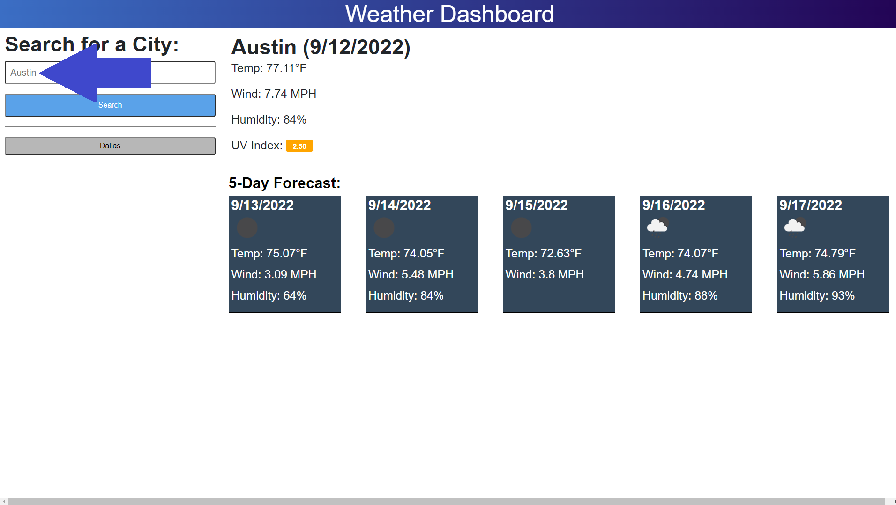
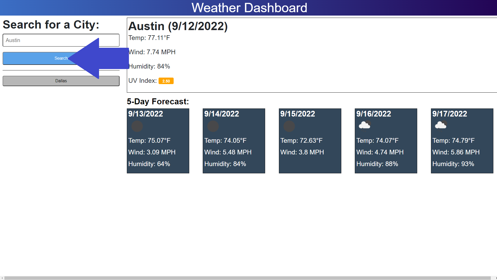

# Cool-Weather

## Description

I wanted to make this project because I wanted to be able to see the weather

## Table of Contents

Link: https://justinsnyder611.github.io/Cool-Weather

- [Installation](#installation)
- [Usage](#usage)
- [Contributing](#contributing)
- [License](#license)
- [Tests](#tests)
- [Questions](#questions)

## Installation

To open the project all you need to do is click the link in the 'Table of Contents' above.

## Usage

You can put a city into the input box

Then you can press the 'search' button to see weather info

## Contributing

- https://www.w3schools.com
- https://openweathermap.org
- https://opencoursehub.cs

## License

MIT License

    Copyright (c) [2022] [JustinSnyder611]
    
    Permission is hereby granted, free of charge, to any person obtaining a copy
    of this software and associated documentation files (the "Software"), to deal
    in the Software without restriction, including without limitation the rights
    to use, copy, modify, merge, publish, distribute, sublicense, and/or sell
    copies of the Software, and to permit persons to whom the Software is
    furnished to do so, subject to the following conditions:
    
    The above copyright notice and this permission notice shall be included in all
    copies or substantial portions of the Software.
    
    THE SOFTWARE IS PROVIDED "AS IS", WITHOUT WARRANTY OF ANY KIND, EXPRESS OR
    IMPLIED, INCLUDING BUT NOT LIMITED TO THE WARRANTIES OF MERCHANTABILITY,
    FITNESS FOR A PARTICULAR PURPOSE AND NONINFRINGEMENT. IN NO EVENT SHALL THE
    AUTHORS OR COPYRIGHT HOLDERS BE LIABLE FOR ANY CLAIM, DAMAGES OR OTHER
    LIABILITY, WHETHER IN AN ACTION OF CONTRACT, TORT OR OTHERWISE, ARISING FROM,
    OUT OF OR IN CONNECTION WITH THE SOFTWARE OR THE USE OR OTHER DEALINGS IN THE
    SOFTWARE.

## Tests

You can put in the city of Austin and get the weather for that city

## Questions

What is your GitHub profile?
JustinSnyder611 : https://github.com/JustinSnyder611

How do I reach you?
justinsnyder611@gmail.com

